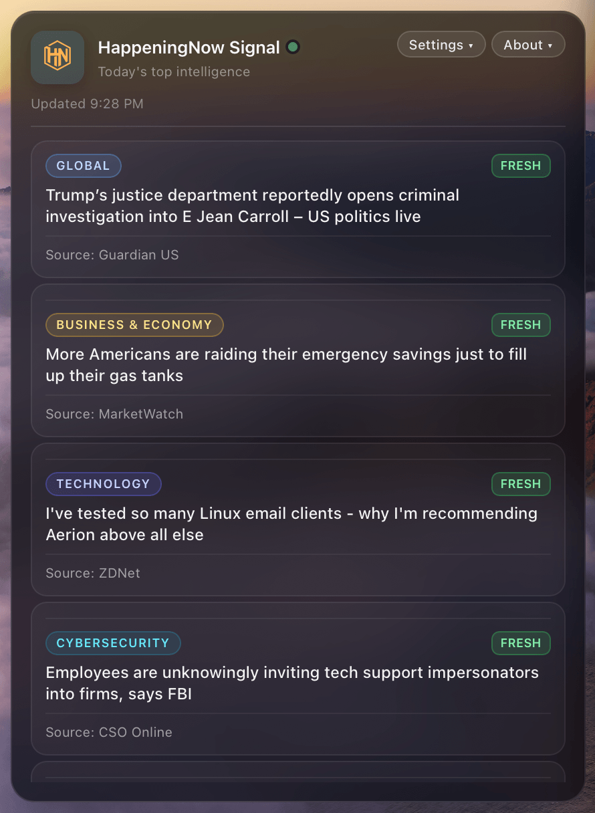
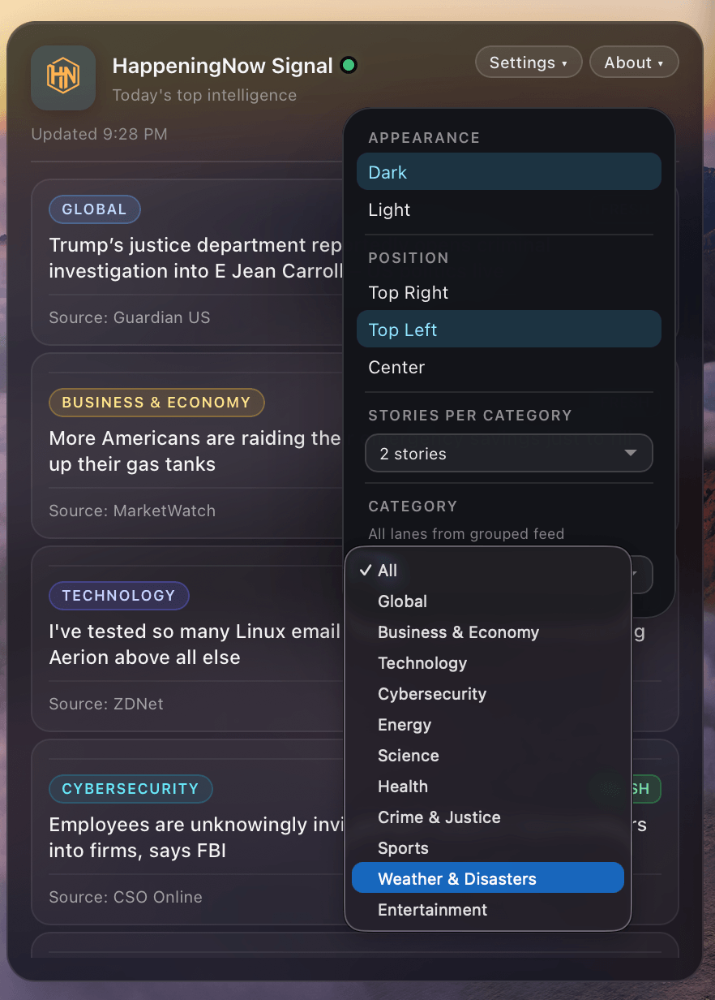
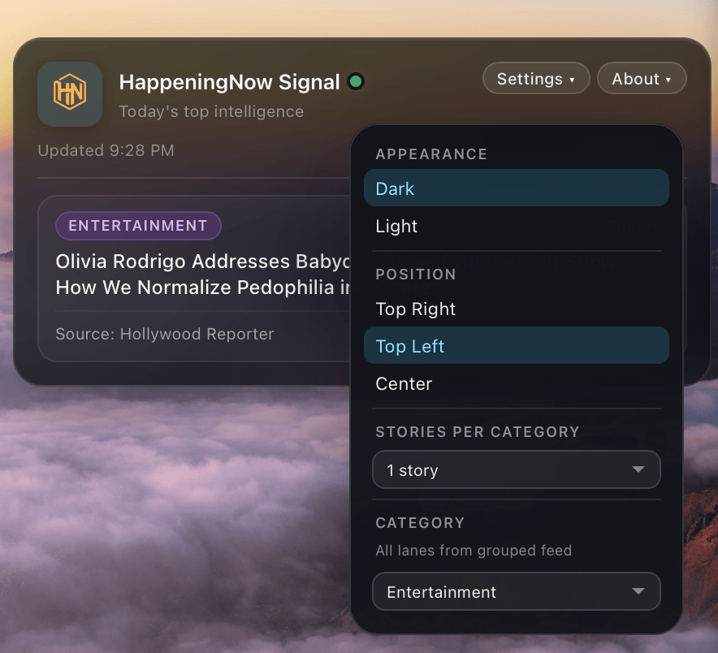
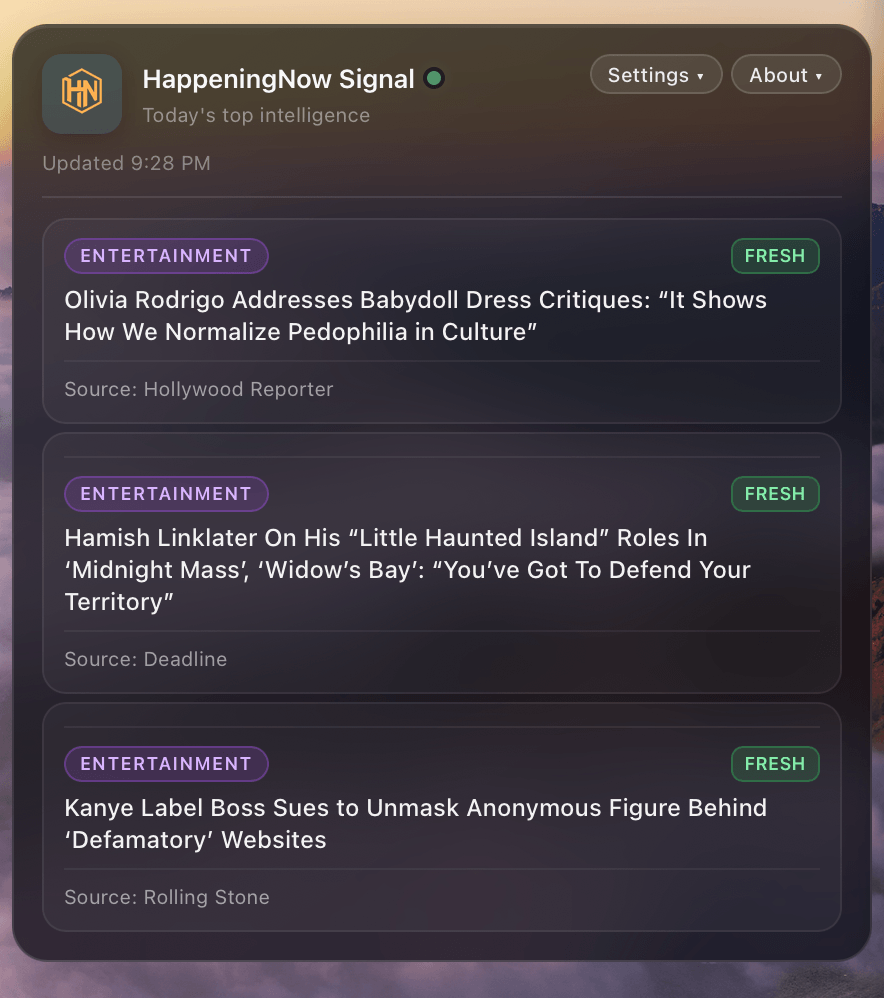

# HappeningNow Signal Widget

A lightweight [Übersicht](https://tracesof.net/uebersicht/) desktop widget for macOS that brings **Today's Signal** from [HappeningNow](https://happeningnow.news) to your desktop — curated, real-time headlines ranked by what matters right now.


<p align="center">
  
</p>

<p align="center"><em>Widget on your desktop — click any headline to open the full story in your browser.</em></p>

## About

**HappeningNow Signal** is a glass-style news panel that sits on your macOS desktop and refreshes automatically from HappeningNow's public feed. No account, API key, or backend setup — just install the widget and read the signal.

Each story tile shows:

- **Category** — Technology, Business, Global, and 8 other lanes
- **Headline** — click to open the story in your browser
- **Source** — where the story originated
- **Freshness** — how active the story is in Today's Signal (see below)
- **Breaking badge** — when a story is flagged as breaking news

### Freshness badges

Each story tile can show a colored badge from the HappeningNow feed. These labels reflect how recently a story entered — or how long it has remained in — **Today's Signal**, not when the original article was published.

| Badge | Meaning |
|-------|---------|
| **Fresh** | Recently surfaced or still actively tracked. These are the newest entries in the signal. |
| **Aging** | Been in the signal for a while. Still relevant, but no longer among the newest picks. |
| **Stale** | Longest-running entry in its lane relative to fresher stories. May still be worth reading, but HappeningNow is treating it as cooling off. |
| **Breaking** | Flagged as breaking news. Shown when HappeningNow marks the story as both breaking and actively developing. |

Badge colors in the widget: **Fresh** is green, **Aging** is amber, **Stale** is red, and **Breaking** uses a distinct red highlight.

Use **Settings** to switch dark/light theme, move the panel (top-right, top-left, or center), filter by category, and choose how many stories appear per lane (1–3). **About** links to the HappeningNow website, public API feed, this GitHub repo, and an optional donation page.

This repository contains **client/widget code only** — no backend, Supabase, Netlify, secrets, or internal APIs.

## What is HappeningNow?

[HappeningNow](https://happeningnow.news) aggregates and ranks breaking stories across categories. The widget reads a public cached JSON feed and displays headlines in a compact, readable panel.

**Public feed:** `https://happeningnow.news/api/public/today.json?view=categories`

## Features

- **One API call** — grouped `today.json?view=categories` only (every 15 minutes)
- **No HTML scraping** — no category-page requests or extra network traffic
- **11 category lanes** — dropdown populated from `categories[]` in the payload
- **All view** — round-robin merge across lanes for a balanced list
- **Per-category view** — shows that lane's stories (up to your stories-per-category setting)
- **Stories per category** — choose 1, 2, or 3 stories per lane in Settings
- **Dark & light themes** — glassmorphism UI with persisted preferences
- **Position control** — top-right (default), top-left, or center
- **Instant shell on launch** — loading UI appears immediately on cold start; cached stories show on return visits while fresh data loads in the background

## Screenshots

<p align="center">
  
</p>

<p align="center"><strong>Default view</strong> — balanced headlines across Global, Business, Technology, Cybersecurity, and more.</p>

<table align="center">
  <tr>
    <td align="center" width="50%">
      <br />
      <strong>Category filter</strong> — all 11 lanes in Settings
    </td>
    <td align="center" width="50%">
      <br />
      <strong>Single story</strong> — Entertainment lane, 1 story per category
    </td>
  </tr>
  <tr>
    <td colspan="2" align="center">
      <br />
      <strong>Three stories</strong> — Entertainment lane, 3 stories per category
    </td>
  </tr>
</table>

## Install Übersicht

1. Download [Übersicht](https://tracesof.net/uebersicht/) for macOS.
2. Open the app and allow it to run (System Settings → Privacy & Security if prompted).
3. Übersicht lives in your menu bar and renders widgets on your desktop.

## Install this widget

### Option A — Clone into your widgets folder

```bash
git clone https://github.com/ReyWins/happeningnow-widget.git
cp -R happeningnow-widget/HappeningNowSignal.widget ~/Library/Application\ Support/Übersicht/widgets/
```

### Option B — Manual copy

1. In Übersicht, choose **Open Widgets Folder** from the menu bar.
2. Copy the `HappeningNowSignal.widget` folder into that directory.
3. Übersicht hot-reloads widgets — the signal should appear within a few seconds.

## Widget controls

| Control | Description |
|---------|-------------|
| **Settings ▾** | Dark/Light theme, screen position (Top Right, Top Left, Center), stories per category (1–3), and category filter (All + all 11 lanes). |
| **About ▾** | Version, website, API feed, GitHub repo, and Donate link. |

Preferences (theme, position, stories per category) are saved in `localStorage` only. Default position: **Top Right**. Default theme: **Dark**. Default stories per category: **3**.

**Note:** Übersicht runs `index.coffee` only. Do not add `index.js` to the widget folder — a stale compiled file can cause parse errors.

## Refresh interval

Default: **15 minutes**.

The public feed is cached server-side, so polling every 10–15 minutes keeps network and CPU use low while staying reasonably fresh. Adjust in `index.coffee`:

```coffee
config =
  refreshMinutes: 15   # try 10–15
```

## Privacy

**Widget consumes a public cached JSON feed. No account or API key required.**

- Lightweight `localStorage` keys for theme, position, stories-per-category, and last feed payload
- No tokens or credentials
- Only calls the public grouped `today.json` endpoint via Übersicht's built-in proxy
- Clicking a story opens `shortUrl` (or `url`) in your default browser

## Customization

Edit `HappeningNowSignal.widget/index.coffee`:

- `config.refreshMinutes` — poll interval
- `config.defaultStoriesPerCategory` — default 1/2/3 limit
- `position.x`, `position.y`, `position.menuGap` — placement offsets
- `style:` block — all widget CSS (Übersicht does not load external stylesheets)

`styles.css` is a reference copy only; the `style:` block in `index.coffee` is what Übersicht applies.

## Repository structure

```
happeningnow-widget/
├── LICENSE
├── README.md
├── screenshots/
│   ├── main.png
│   ├── default.png
│   ├── categories.png
│   ├── ent-1st.png
│   └── ent-3.png
└── HappeningNowSignal.widget/
    ├── index.coffee
    ├── logo.webp
    └── styles.css
```

## Requirements

- macOS with Übersicht installed
- Network access (public JSON feed only)

## Changelog

### 2.2.9
- **Background fetch + cache** — feed data loads asynchronously in the browser. The last successful payload is saved to `localStorage`, so return visits show cached stories right away while fresh data loads behind the scenes.
- **Smarter refresh behavior** — existing stories stay visible during normal refreshes. A thin top progress bar indicates background updates; the full loading state only appears when there are zero stories to show.
- **Settings menu layout** — settings dropdown height increased so all options fit without a scrollbar.
- **README** — added screenshots, freshness badge guide, and this changelog.

## Support the project

If you find this widget useful, you can [buy me a coffee](https://buymeacoffee.com/happeningnow) to support HappeningNow and ongoing widget updates.

## License

MIT — see [LICENSE](LICENSE).

## Links

- [HappeningNow](https://happeningnow.news)
- [Public grouped feed](https://happeningnow.news/api/public/today.json?view=categories)
- [Übersicht](https://tracesof.net/uebersicht/)
- [GitHub repository](https://github.com/ReyWins/happeningnow-widget)
- [Donate](https://buymeacoffee.com/happeningnow)
